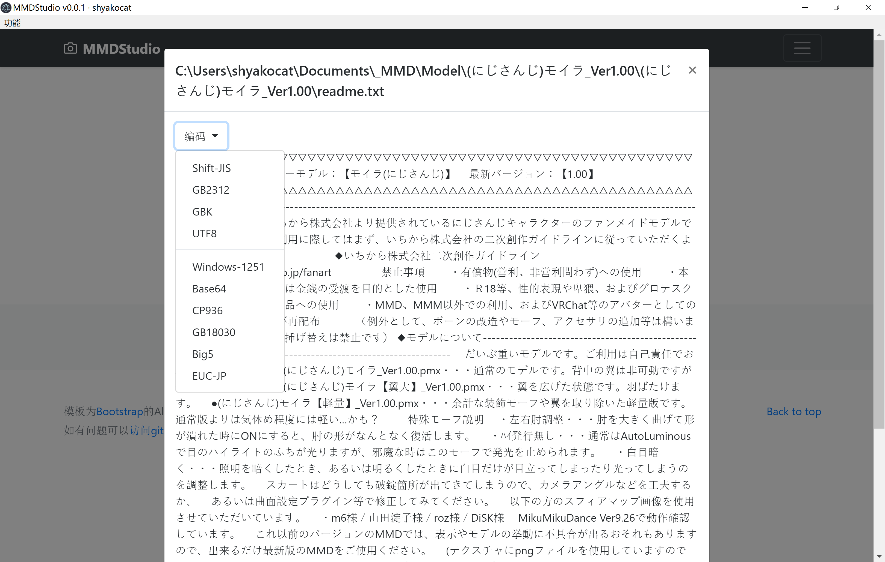
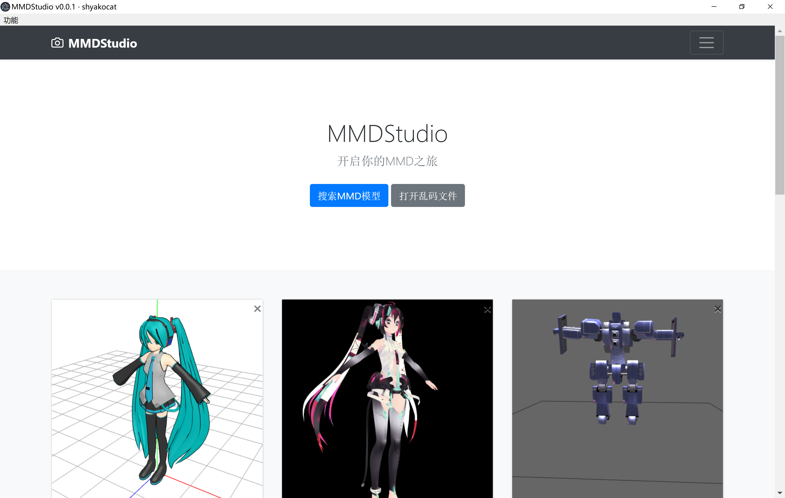
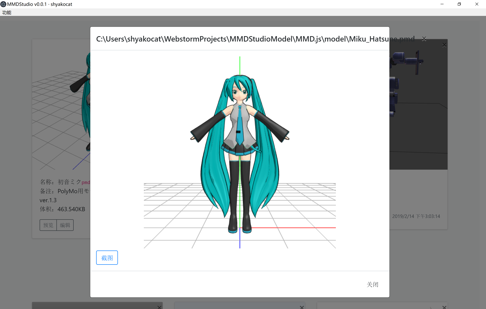
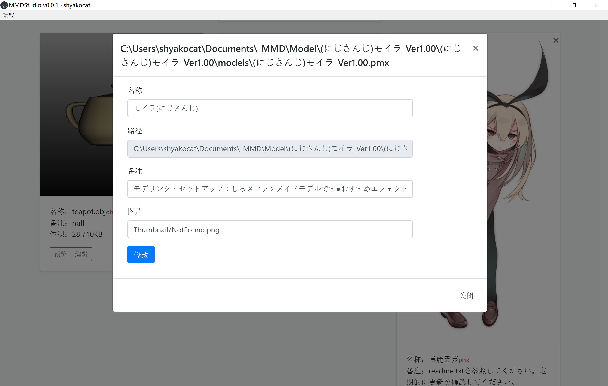
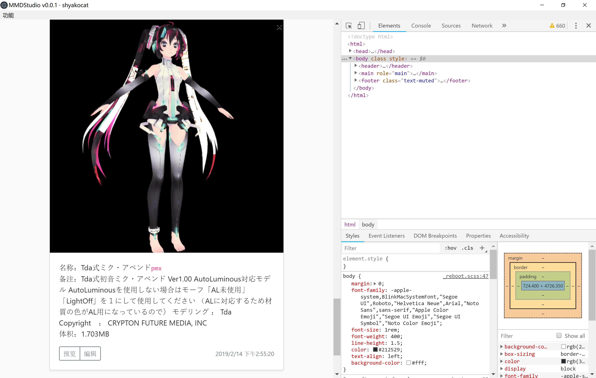
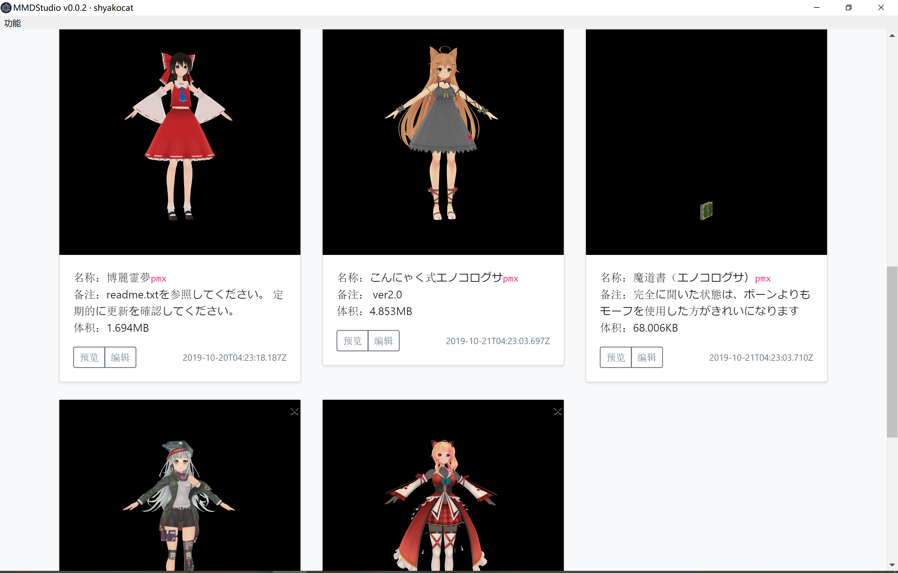

# MMDStudio

## 简介

MMDStudio(当然这只是我随口编的一个很通俗的名字，以后可以改呗)是基于Electron的桌面应用，以前端的解决方案来预览MMD模型和打开乱码文件。

虽然已经两三年没玩MMD了，但是借物表必须写一下。

- UI框架Bootstrap:[https://github.com/twbs/bootstrap](https://github.com/twbs/bootstrap)
- Pmd模型:[https://github.com/edvakf/MMD.js](https://github.com/edvakf/MMD.js)
- Pmx模型:[https://github.com/takahirox/MMDLoader-app](https://github.com/takahirox/MMDLoader-app)
- X模型:[https://github.com/adrs2002/threeXfileLoader](https://github.com/adrs2002/threeXfileLoader)
- Obj模型:[https://github.com/dendory/3dviewer](https://github.com/dendory/3dviewer)
- (已经不再使用)Pmx模型:[https://github.com/Naouak/PMX-viewer](https://github.com/Naouak/PMX-viewer)
- (已经不再使用)辅助读取贴图:[https://github
.com/toji/webgl-texture-utils](https://github.com/toji/webgl-texture-utils)

以上代码可能都经过了一些修改以适应软件运行。

## 使用

Q:怎么运行？ A:新建目录Bootstrap后在内克隆bootstrap的仓库。然后npm install。运行npm start。

Q:Windows下怎么导出exe？  A:修改index.html中的switch_electronbuild为true。命令参照package.json中的npm pack部分。

## 注意

这部分主要陈述BUG与缺陷的，以后接着补充。

- pmx模型仍有许多不能绘制的情况
- 代码臭长，毫无规范，不堪入目，垃圾回收部分做的真的垃圾——如果js实现了真的垃圾回收，恐怕我写的代码会被回收掉
- 没做页内搜索、筛选之类的功能，而Electron又不像浏览器那样有Ctrl+F，所以如果想搜索模型可以凑合着在开发者工具里Ctrl+F
- 众知Electron是套了层Chromium的，所以可执行文件很大。
- 内存占用多，性能差。
- 这款软件只是提供了基础的预览，动作、渲染、物理等不在范围内。

没想到寒假之后还能更新...那再补充点

- 未使用vue等框架，直接用jQuery。耦合度太高了。
- 存在内存泄漏，还需对three.js、chrome学习以解决。

## 寄语

开启你的MMD之旅

当然我建议你不要用这款软件，它只会折腾死人。其实shy是第一次用js写代码，诸多不足，我会在以后的开发中以此为鉴。

欢迎意见与改进！

## 图片

